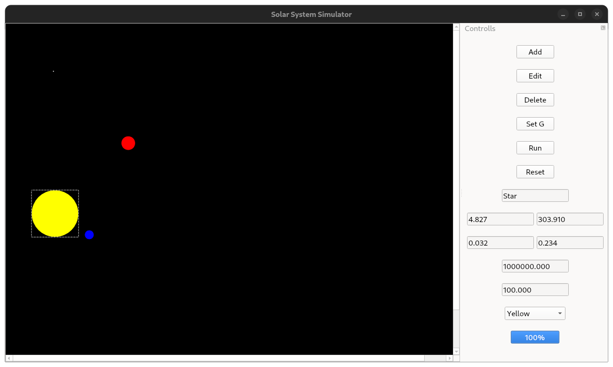

# Celestial Physics Simulation - Planetary Obeservatory

> This project was first developed in 2015 and later published in 2025.

GUI for simple 3D n-body simulation in Qt

## Requirements
 - gmp
 - Qt4
